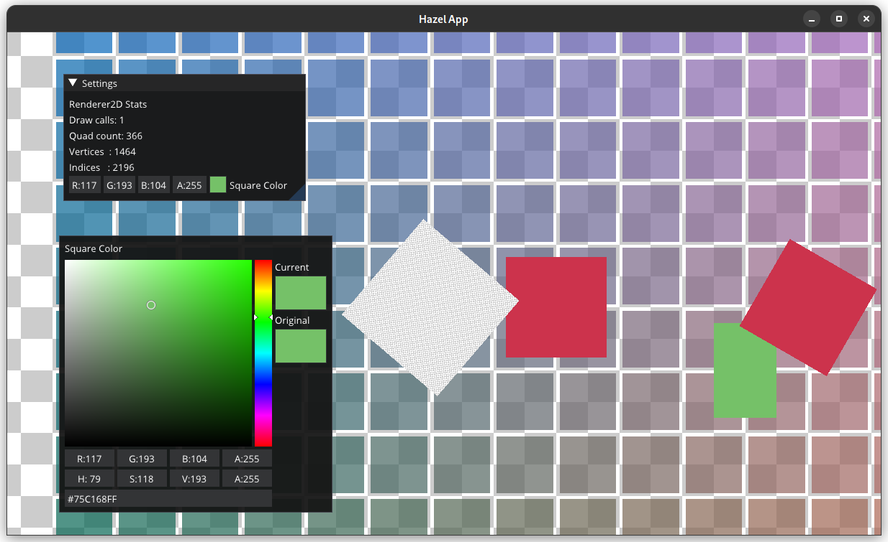
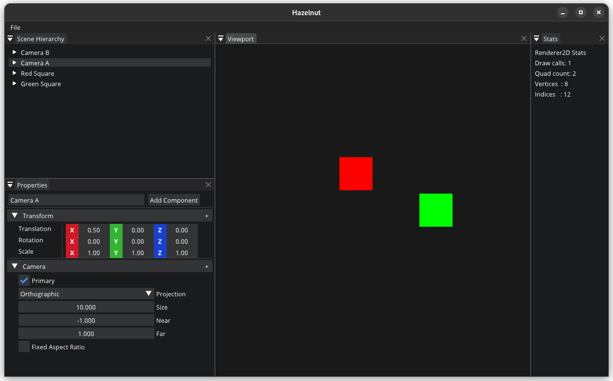

# Kotlin Hazel

A game engine written in Kotlin/Native, based on the [YouTube tutorial series](https://youtube.com/playlist?list=PLlrATfBNZ98dC-V-N3m0Go4deliWHPFwT) by Yan Chernikov aka The Cherno. His original code for the tutorial series can be found [on his GitHub repo](https://github.com/thecherno/hazel).

This repository is current with the "Scene Serialization" episode released 23 Oct 2020.

This project features two notable custom implementations replacements for C++-only libraries used in the tutorial: `glm` and `entt` were replaced with minimal custom implementations written in Kotlin. The `glm` replacement implementation features Intel compiler intrinsics for vectorized operations.

## Dependencies

[KGL](https://github.com/Dominaezzz/kgl) and [Kotlin-ImGui](https://github.com/Dominaezzz/kotlin-imgui), the two core dependencies, currently rely on tweaked local builds due to the sunsetting of JCenter and lack of development of the libraries since this repository was last updated. To be compatible with the current version of this repository, these local builds must be built with Kotlin 1.4.30. Kotlin-ImGui must be built with `version = "0.1.7-docking"`, `imguiVersion = "1.77dock"`, and `mavenLocal()` in each `repositories` block.

## Screenshots

